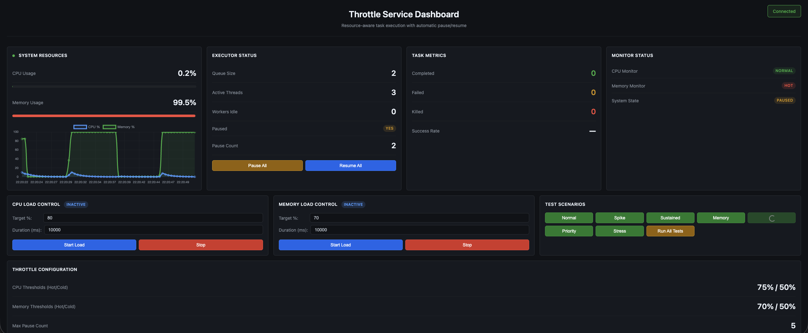

<h1 align="center">Throttle</h1>

<p align="center">
  <a href="https://central.sonatype.com/artifact/io.github.sdeonvacation/throttle"></a>
  
  <a href="https://github.com/sdeonvacation/throttle/blob/master/LICENSE"></a>
  <a href="https://javadoc.io/doc/io.github.sdeonvacation/throttle"></a>
  
</p>

<p align="center">
  <b>A resource-aware executor for chunkable workloads - calm under load, relentless when clear.</b>
</p>

<p align="center">
  <a href="#key-features">Features</a> •
  <a href="#quick-start">Quick Start</a> •
  <a href="#why-use-throttle">Why Throttle?</a> •
  <a href="#configuration-options">Configuration</a> •
  <a href="#simulator">Simulator</a> •
  <a href="https://github.com/sdeonvacation/throttle/issues">Report Bug</a> •
  <a href="https://github.com/sdeonvacation/throttle/issues">Request Feature</a>
</p>

---

<p align="center">
  <i>Offload heavy background tasks to Throttle and let your application focus on business logic</i>
</p>

## Overview

Throttle is a sophisticated task execution framework that automatically adapts to system resource availability. It monitors CPU and memory usage and intelligently pauses/resumes task execution to prevent system overload, making it ideal for resource-intensive batch processing applications.

**Designed for chunkable workloads** - Tasks must be splittable into chunks (logical units of work) that act as checkpoints. This is fundamental because Java provides no way to natively pause and resume a running thread mid-execution.

**Offload Heavy Background Tasks**: Submit any application's heavy background tasks (data processing, file operations, batch jobs, report generation) to Throttle, allowing your application to focus on running actual business logic while Throttle manages resource-intensive operations intelligently.

## Key Features

- **Automatic Resource Monitoring**: Continuously monitors CPU and memory usage
- **Adaptive Pause/Resume**: Automatically pauses task execution when resources are constrained and resumes when resources become available
- **Chunked Task Execution**: Tasks are split into chunks that serve as checkpoints for pausing/resuming. This is essential because there is no way to natively pause a running task/thread and resume it at the same point without the support of the task itself - tasks must have checkpoints where they can be paused
- **Priority-Based Scheduling**: Supports HIGH, MEDIUM, and LOW priority tasks
- **Task Termination**: Configurable task killing for tasks that pause too frequently
- **Configurable Thresholds**: Customizable hot/cold thresholds for CPU and memory
- **Hysteresis Support**: Prevents rapid oscillation between pause/resume states
- **Queue Management**: Bounded queues with configurable overflow policies
- **Comprehensive Monitoring**: Built-in metrics for task completion, failures, and resource usage
- **Full Client Control**: You control everything - thread pools, thresholds, intervals, and policies. Bring your own ExecutorService or use defaults.

## Why Use Throttle?

Modern applications often need to run heavy background tasks alongside their core business logic:
- **Data processing** - ETL pipelines, batch transformations, analytics
- **File operations** - Bulk uploads, media processing, archive generation
- **Database operations** - Bulk updates, migrations, cleanup jobs
- **Report generation** - Scheduled reports, data exports, PDF generation
- **API integrations** - Rate-limited batch API calls, webhook processing

**The Problem**: Running these tasks directly in your application can:
- Starve resources from critical business logic
- Cause performance degradation during high-load periods
- Lead to unpredictable response times and system instability

**The Solution**: Submit heavy background tasks to Throttle and let it handle resource management automatically. Your application stays responsive and focused on business logic while Throttle:
- Monitors system resources (CPU/memory) continuously
- Pauses background tasks when resources are constrained
- Resumes tasks automatically when resources become available
- Prioritizes critical tasks over routine maintenance jobs
- Terminates problematic tasks that consume excessive resources

**Complements Auto-Scaling**: Throttle works alongside auto-scaling strategies, not instead of them:
- **Task-level vs Instance-level**: While auto-scaling adds more instances to handle load, Throttle manages resource contention between tasks running on the same instance
- **Cost efficiency**: Throttle optimizes existing resources before you need to scale, potentially reducing the number of instances required
- **Background work coordination**: Throttle intelligently pauses low-priority tasks when resources are needed for high-priority work, something horizontal scaling can't address within each instance
- **Predictable performance**: Instead of unpredictable resource contention, Throttle provides deterministic behavior where background tasks yield to critical work
- **Comprehensive strategy**: Use both auto-scaling to add capacity across instances and Throttle to optimize utilization within each instance

**Essential for Non-Autoscaling Environments**: In platforms where auto-scaling is not available (e.g., Cloud Foundry, on-premise deployments, fixed-capacity environments), Throttle becomes critical for preventing OutOfMemoryErrors and CPU exhaustion. Without auto-scaling to add capacity, Throttle ensures your application survives load spikes by automatically throttling background work.

## Complete Client-Side Control

**You control everything** - Throttle provides intelligent resource management without dictating how your application should run:

### 🎛️ Control Your Thread Pools
- **Worker threads**: Provide your own `ExecutorService` for task execution or use the default (2 threads)
- **Monitoring threads**: Provide your own `ExecutorService` for monitoring/coordination or use the default (2 threads)
- **Example**: `Executors.newFixedThreadPool(10)`, `Executors.newCachedThreadPool()`, or any custom implementation

### 🔧 Configure All Parameters
Every aspect is configurable:
- **CPU/Memory thresholds**: Set hot/cold percentages for pause/resume decisions
- **Monitoring intervals**: Control how often resources are checked
- **Queue capacity**: Define maximum pending tasks
- **Overflow policies**: Choose REJECT, DISCARD_OLDEST, or BLOCK behavior
- **Task termination**: Set max pause count before killing tasks
- **Anti-starvation**: Configure priority boosting thresholds
- **Hysteresis**: Prevent rapid state oscillations

### 📊 Full Observability
Access detailed metrics at any time:
- Active tasks, queue size, completed/failed/killed counts
- Pause count, total pause duration, current state
- Per-monitor states (CPU, memory, custom monitors)
- Killed task history for inspection

**No hidden magic** - Throttle is a transparent, configurable executor that adapts to your needs.

## Quick Start

### Maven Dependency

```xml
<dependency>
    <groupId>io.github.sdeonvacation</groupId>
    <artifactId>throttle</artifactId>
    <version>1.0.0</version>
</dependency>
```

### Usage Example

> **Why extend AbstractChunkableTask?** Java doesn't provide a way to natively pause a running thread and resume it from the same point. Throttle solves this by splitting work into **chunks that act as checkpoints** - the executor can pause a task after completing a chunk and resume it later from the next chunk.

Consider an e-commerce application that processes orders (business logic) and also runs batch reports (background task):

#### Before: Using standard ExecutorService

```java
@Service
public class OrderService {
    private final ExecutorService backgroundExecutor = Executors.newFixedThreadPool(4);

    // Business logic - must stay responsive
    public Order createOrder(OrderRequest request) {
        return orderRepository.save(new Order(request));
    }

    // Background task - processes thousands of records
    public void generateDailyReport(List<Order> orders) {
        backgroundExecutor.submit(() -> {
            for (Order order : orders) {
                reportService.process(order);  // Delays business logic, increases latency,
            }                                   // and can cause resource exhaustion/OOMs
        });
    }
}
```

**Problem:** During peak traffic, `generateDailyReport()` competes with `createOrder()` for CPU/memory. Your customers experience slow checkouts because background reports are consuming resources.

#### After: Using Throttle

```java
@Service
public class OrderService {
    private final ThrottleService backgroundExecutor = ThrottleServiceFactory.builder()
        .cpuMonitor(75, 50)      // Pause background tasks when CPU > 75%
        .memoryMonitor(70, 50)   // Pause when memory > 70%
        .build();

    // Business logic - stays responsive because background tasks pause when needed
    public Order createOrder(OrderRequest request) {
        return orderRepository.save(new Order(request));
    }

    // Background task - automatically pauses when system is under load
    public void generateDailyReport(List<Order> orders) {
        // process orders in chunks of 100
        backgroundExecutor.submit(new AbstractChunkableTask<Order>(orders, Priority.LOW, 100) {
            @Override
            public void processChunk(List<Order> chunk) {
                for (Order order : chunk) {
                    reportService.process(order);  // Pauses at chunk boundaries
                }                                   // when CPU/memory is high
            }
        });
    }
}
```

**Result:** During peak traffic, Throttle automatically pauses `generateDailyReport()` to free up resources for `createOrder()`. When traffic subsides, reports resume automatically.

## AbstractChunkableTask API Reference

To create a task, extend `AbstractChunkableTask<T>` and implement `processChunk()`:

```java
public abstract class AbstractChunkableTask<T> {

    // Constructor: items to process, priority level, items per chunk
    protected AbstractChunkableTask(List<T> items, Priority priority, int chunkSize);

    // REQUIRED: Process one chunk of items (called repeatedly until all items done)
    public abstract void processChunk(List<T> chunk) throws Exception;

    // OPTIONAL: Called when all chunks complete successfully
    public void onComplete() {}

    // OPTIONAL: Called when task fails or is killed
    public void onError(Throwable error) {}

    // OPTIONAL: Called when task is cancelled
    public void onCancel() {}

    // Utility methods available to your implementation
    protected int getTotalItemCount();  // Total items in task
    protected int getChunkSize();       // Configured chunk size
    public String getTaskId();          // Unique task ID
    public int getPauseCount();         // Times this task was paused
    public Priority getPriority();      // Task priority (HIGH/MEDIUM/LOW)
}
```

**How it works:** You provide a list of items and a chunk size. Throttle automatically:
1. Splits your items into chunks
2. Calls `processChunk()` for each chunk
3. Checks CPU/memory between chunks — pauses if resources are constrained
4. Resumes from the next chunk when resources are available
5. Calls `onComplete()` when done, or `onError()` if something fails

## Spring Boot Integration

Throttle works as a standard Spring Bean. Create a `@Bean` and inject it where needed:

```java
@Configuration
public class ThrottleConfig {

    @Bean
    public ThrottleService throttleService() {
        return ThrottleServiceFactory.builder()
            .workerThreadPool(Executors.newFixedThreadPool(4))
            .cpuMonitor(75, 50)
            .memoryMonitor(70, 50)
            .build();
    }

    @PreDestroy
    public void shutdown() {
        throttleService().shutdown();
    }
}

@Service
public class ReportService {

    @Autowired
    private ThrottleService throttleService;  // Inject and use

    public void generateReport(List<Order> orders) {
        throttleService.submit(new AbstractChunkableTask<>(orders, Priority.LOW, 100) {
            @Override
            public void processChunk(List<Order> chunk) {
                // process chunk
            }
        });
    }
}
```

## Comparison with Alternatives

| Feature | Throttle | Standard ExecutorService | Resilience4j Bulkhead | Spring Batch |
|---------|----------|--------------------------|----------------------|--------------|
| CPU-aware auto-pause | ✅ | ❌ | ❌ | ❌ |
| Memory-aware throttling | ✅ | ❌ | ❌ | ❌ |
| Chunked checkpoints | ✅ | ❌ | ❌ | ✅ |
| Priority scheduling | ✅ | ❌ | ❌ | Limited |
| Zero dependencies | ✅ | ✅ | ❌ | ❌ |
| Auto-resume when resources free | ✅ | ❌ | ❌ | ❌ |
| Client controls thread pools | ✅ | ✅ | ✅ | Limited |

**When to use Throttle:** Background tasks that are chunkable and should yield to business logic when resources are tight.

**When NOT to use Throttle:**
- Sub-millisecond latency requirements (chunk overhead adds ~1ms)
- Tasks that can't be split into chunks (e.g., single atomic operations)
- You need a full job scheduler with persistence (use Quartz or Spring Batch)
- Simple fire-and-forget tasks with no resource concerns (use plain ExecutorService)

## Architecture

### Core Components

- **ThrottleService**: Main entry point, manages task submission and execution lifecycle
- **MonitoringCoordinator**: Monitors system resources (CPU/memory) and determines pause/resume state
- **ExecutionCoordinator**: Coordinates task execution, pause/resume, and termination
- **TaskExecutor**: Executes individual tasks with pause/resume support
- **AdaptiveTask**: Base class for tasks that support chunked execution with pause points

### Monitoring Strategy

The executor uses a checkpoint-driven monitoring approach to minimize CPU overhead:

1. **Checkpoint-Driven Monitoring**: Monitors are sampled only when tasks reach chunk boundaries (checkpoints), not continuously
2. **Debounced Sampling**: Multiple workers hitting checkpoints simultaneously trigger only one monitor sample (100ms debounce window)
3. **Resume Detection**: While paused, a dedicated monitoring thread polls every 5 seconds to detect when resources cool down

This approach ensures near-zero monitoring overhead - monitors are only checked at natural pause points in task execution.

### Task Lifecycle

```
SUBMITTED → QUEUED → RUNNING → [PAUSED] → RUNNING → COMPLETED/FAILED/KILLED
```

- Tasks can be paused multiple times during execution
- Tasks exceeding `maxPauseCount` are terminated with `TaskTerminatedException`
- Failed tasks trigger `onError()` callback

## Configuration Options

**All parameters are client-controlled** - customize every aspect to fit your application's needs:

| Option | Description | Default | Your Control |
|--------|-------------|---------|--------------|
| `workerThreadPool` | Thread pool for task execution | Fixed pool of 2 threads | **Provide your own or use default** |
| `monitoringThreadPool` | Thread pool for monitoring/coordination | Fixed pool of 2 threads | **Provide your own or use default** |
| `queueCapacity` | Maximum tasks in queue | 100 | **Set based on your workload** |
| `cpuMonitor(hot, cold)` | CPU thresholds (%) | 75, 50 | **Tune for your hardware** |
| `memoryMonitor(hot, cold)` | Memory thresholds (%) | 70, 50 | **Tune for your heap size** |
| `hysteresis` | Minimum time in state before transition | 10 seconds | **Adjust stability vs responsiveness** |
| `coldMonitoringInterval` | Resume detection polling (while paused) | 5 seconds | **Balance between latency & overhead** |
| `hotMonitoringDebounceInterval` | Min time between checkpoint samples | 100ms | **Prevent redundant sampling** |
| `maxPauseCount` | Max pauses before task termination | 5 | **Control task killing behavior** |
| `taskTerminationEnabled` | Enable automatic task termination | true | **Enable/disable as needed** |
| `starvationThreshold` | Time before priority boost | 2 hours | **Prevent task starvation** |
| `overflowPolicy` | Queue overflow behavior | REJECT | **REJECT, DISCARD_OLDEST, or BLOCK** |

### Thread Pool Examples

You have **complete control** over the thread pools:

```java
// Example 1: Large worker pool for high throughput
ThrottleService executor = ThrottleServiceFactory.builder()
    .workerThreadPool(Executors.newFixedThreadPool(20))
    .monitoringThreadPool(Executors.newFixedThreadPool(2))  // monitoring threads
    .build();

// Example 2: Cached thread pool for dynamic workloads
ThrottleService executor = ThrottleServiceFactory.builder()
    .workerThreadPool(Executors.newCachedThreadPool())
    .build();

// Example 3: Custom thread factory with naming
ThreadFactory factory = new ThreadFactoryBuilder()
    .setNameFormat("my-app-worker-%d")
    .build();
ThrottleService executor = ThrottleServiceFactory.builder()
    .workerThreadPool(Executors.newFixedThreadPool(10, factory))
    .build();

// Example 4: Use defaults (2 threads each)
ThrottleService executor = ThrottleServiceFactory.builder()
    .cpuMonitor(80, 55)  // Just configure thresholds
    .build();
```

## Simulator/Monitoring

**For Testing & Visualization Only** - The project includes a comprehensive simulator with a live dashboard for testing Throttle's behavior:

```bash
cd simulator
mvn spring-boot:run
# Open http://localhost:8080/api/simulator/dashboard
```


*Simulator dashboard showing real-time CPU/memory usage, task metrics, and pause/resume behavior*

**Features:**
- Real-time monitoring dashboard with WebSocket updates
- 12 test scenarios (7 positive, 5 edge cases)
- Independent CPU and memory load generators
- Live visualization of task execution and system state

**Note:** The dashboard is part of the simulator test package only. Throttle itself is a library with no UI - you can monitor it using the built-in APIs:

```java
// Get executor metrics
ExecutorMetrics metrics = throttleService.getMetrics();
System.out.println("Active threads: " + metrics.getActiveThreads());
System.out.println("Queue size: " + metrics.getQueueSize());
System.out.println("Tasks completed: " + metrics.getTasksCompleted());
System.out.println("Is paused: " + metrics.isPaused());

// Get monitor states
List<ResourceMonitor> monitors = throttleService.getMonitors();
for (ResourceMonitor monitor : monitors) {
    MonitorMetrics monitorMetrics = monitor.getMetrics();
    System.out.println(monitor.getId() + ": " + monitor.evaluate());
}
```

Integrate these metrics into your own monitoring systems (Prometheus, Grafana, DataDog, etc.).

See [simulator/docs/README.md](simulator/docs/README.md) for details.

## Roadmap

Planned enhancements (see [INTELLIGENT_FEATURES_PROPOSAL.md](INTELLIGENT_FEATURES_PROPOSAL.md) for details):

- **Per-Task Metrics** - Deep visibility into task execution (queue wait, execution time, pause count)
- **Health Scoring** - At-a-glance system health with component breakdown
- **Anomaly Detection** - Detect execution time anomalies and excessive pauses using statistical analysis
- **Workload Profiling** - Learn task characteristics and recommend optimal chunk sizes

All planned features are designed with minimal overhead (~250KB memory, <10ms CPU per task).

## Requirements

- Java 17+
- Maven 3.6+

## Building

```bash
mvn clean install
```

## Testing

```bash
mvn test
```

## License

[Apache License 2.0](LICENSE)

## Security

Security is a top priority for Throttle. We use multiple layers of security scanning and testing:

- **CodeQL**: Automated security scanning on every commit and PR
- **FindSecBugs**: Static analysis for security vulnerabilities
- **OWASP Dependency Check**: Continuous monitoring of dependencies for known vulnerabilities
- **Dependabot**: Automated dependency updates for security patches

For reporting security vulnerabilities, please see our [Security Policy](SECURITY.md).

## Contributing

Contributions are welcome! Please see [CONTRIBUTING.md](CONTRIBUTING.md) for guidelines.

### Contributors

<a href="https://github.com/sdeonvacation/throttle/graphs/contributors">
  
</a>

## Community & Support

- 💬 **Discussions**: [GitHub Discussions](https://github.com/sdeonvacation/throttle/discussions) - Ask questions, share ideas
- 🐛 **Issues**: [GitHub Issues](https://github.com/sdeonvacation/throttle/issues) - Report bugs or request features
- ⭐ **Star this repo** if you find it useful!
- 🍴 **Fork & contribute** - We appreciate all contributions

## Star History

[](https://star-history.com/#sdeonvacation/throttle&Date)

---

<p align="center">
  Made with ❤️ by <a href="https://www.linkedin.com/in/mauryasam">Sambhrant Maurya</a>
</p>

<p align="center">
  <sub>If you find Throttle useful, please consider giving it a ⭐ on GitHub!</sub>
</p>
