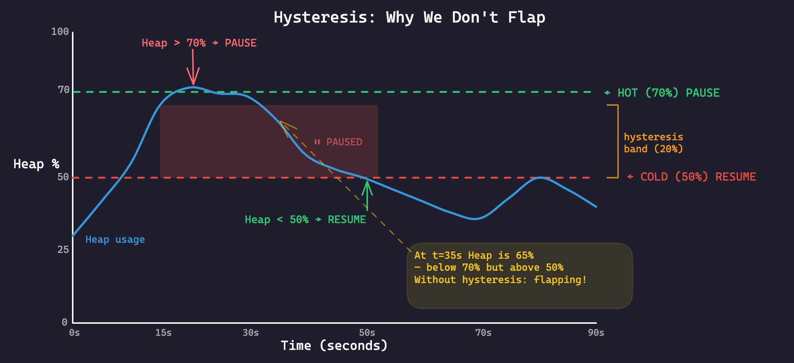
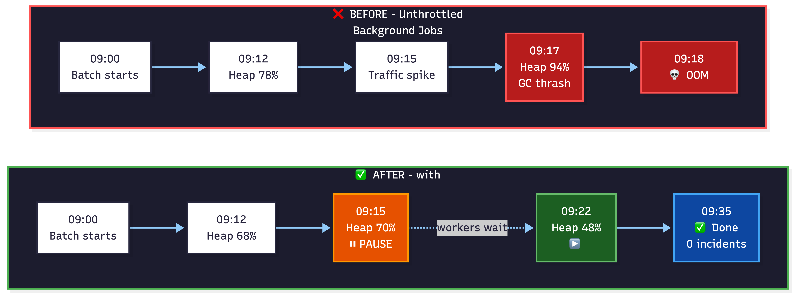

# When Background Jobs Learn to Yield: Checkpoint-Driven Backpressure for Java

*A background batch kept crashing a multi-tenant Java service. Checkpoint-driven backpressure cut OOM incidents by 80% in one real workload — and became an open-source library.*

We ran a multi-tenant microservice at SAP where daily telemetry and cleanup jobs touched thousands of tenants. Most days were fine. Then a background batch would overlap with a production traffic spike.

Heap jumped from 60% to **94% in under three minutes**. On Cloud Foundry, the app crashed. On Kubernetes, the crashes stopped, but the platform scaled up just to keep background work running that could have waited 30 seconds.

**Root cause:** the jobs had no feedback loop from CPU or heap pressure, so they kept running at full speed when production traffic needed the JVM.

## The Fix in One Sentence

**Throttle pauses chunked background work when CPU or heap crosses a threshold, then resumes automatically when the JVM recovers.**

## The Problem Most Solutions Get Wrong

Here's what a typical scheduled background job looks like in a Spring Boot service:

```java
@Service
public class TelemetryService {

    private final ThreadPoolTaskExecutor backgroundPool;

    public TelemetryService() {
        this.backgroundPool = new ThreadPoolTaskExecutor();
        backgroundPool.setCorePoolSize(4);
        backgroundPool.setMaxPoolSize(4);
        backgroundPool.setQueueCapacity(500);
        backgroundPool.initialize();
    }

    @Scheduled(cron = "0 0 9 * * *")  // Every day at 9 AM
    public void collectTelemetry() {
        List<Tenant> tenants = tenantRepository.findAll();  // 3,000 tenants
        for (Tenant tenant : tenants) {
            backgroundPool.submit(() -> {
                telemetryCollector.collect(tenant);  // HTTP calls, object allocation, CPU work
            });
        }
    }
}
```

This is the shape of the production code we had. `ThreadPoolTaskExecutor` with bounded pool and `@Scheduled` trigger will still burn CPU and heap while production API requests negotiate for whatever is left. In our case, it kept going until the JVM did not.

### "But Can't I Just Use...?"

You might think: "I'll just use rate limiting" or "Resilience4j has a bulkhead." Let's be honest about what those actually do:

| Approach | What It Does | What It Doesn't Do |
|----------|-------------|-------------------|
| **Rate limiting** | Caps throughput | Doesn't react to CPU/memory pressure |
| **Resilience4j Bulkhead** | Limits concurrent calls | Doesn't pause when system is stressed |
| **Spring Batch** | Manages batch jobs | Doesn't auto-pause on resource contention |
| **Bounded thread pool** | Limits parallelism | A single thread can still OOM you; doesn't *pause* based on actual system state |
| **Auto-scaling** | Adds more pods | Takes minutes; doesn't fix *within-pod* contention |

None of these are *resource-aware*. They cap concurrency or throughput, but they do not react to live CPU, heap, or JVM pressure. The missing piece is **feedback from the runtime itself**.

## The Pattern: Chunk-Based Execution with Resource Checkpoints

The fix is a pattern I call **checkpoint-driven backpressure**. The idea is simple:

1. Split your work into chunks (batches of N items)
2. After each chunk, check system resources (CPU, memory)
3. If the system is stressed → pause. Actually block the thread. Zero CPU cost.
4. When resources recover → resume from exactly where you left off

Here's why this works: Java can't pause a thread mid-execution. But if you structure your work as chunks, you create natural **safe points** where pausing costs nothing and loses no progress. Think of them as checkpoints in a video game, except the boss fight is CPU and heap pressure.


*Workers process one chunk, check pressure, pause if hot, and resume when healthy.*

Your API stays responsive. Background job finishes eventually. Nobody gets paged. Operationally, "nobody gets paged" is about as close to elegance as it gets.

## Implementing This in Java

I built [Throttle](https://github.com/sdeonvacation/throttle) to implement this pattern. It is a drop-in replacement for `ExecutorService`, but there is a real trade-off: **your tasks need to be restructured into chunks.** Swapping executors is easy; persuading a task to become chunkable is the part that asks follow-up questions.

Here's what the executor setup looks like:

```java
ThrottleService executor = ThrottleServiceFactory.builder()
    .cpuMonitor(75, 50)     // Pause at 75% CPU, resume at 50%
    .memoryMonitor(70, 50)  // Pause at 70% heap, resume at 50%
    .build();
```

### Writing a Task

Your work needs to be chunkable — split into batches. Most batch processing already is:

```java
public class TelemetryTask extends AbstractChunkableTask<Tenant> {

    public TelemetryTask(List<Tenant> tenants) {
        super(tenants, Priority.LOW, 50);  // 50 tenants per chunk
    }

    @Override
    public void processChunk(List<Tenant> chunk) {
        for (Tenant tenant : chunk) {
            telemetryCollector.collect(tenant);
        }
        // After this returns, Throttle checks CPU and memory.
    }
}
```

Submit it like any other executor task: `Future<Void> future = executor.submit(new TelemetryTask(tenants));`

### Choosing a Chunk Size

Chunk size controls how responsive pausing is versus how much checkpoint overhead you pay:

- **Start with 50–200 items** for most batch workloads.
- **Aim for 200ms–2s per chunk.** Smaller chunks react faster; larger chunks reduce overhead but delay pause response.
- **Profile and adjust.** If chunks take under 100ms, you are probably checking too often. If they take over 5s, you are probably checking too rarely.

### Spring Boot Integration with @Scheduled

Here's a realistic migration — replacing the `ThreadPoolTaskExecutor` from the earlier example with Throttle, including graceful shutdown:

```java
@Configuration
public class ThrottleConfig {

    @Bean(destroyMethod = "shutdown")
    public ThrottleService throttleService() {
        return ThrottleServiceFactory.builder()
            .cpuMonitor(75, 50)
            .memoryMonitor(70, 50)
            .workerThreadPool(Executors.newFixedThreadPool(4))
            .queueCapacity(200)
            .maxPauseCount(5)
            .taskTerminationEnabled(true)
            .build();
    }
}

@Service
public class TelemetryService {

    @Autowired
    private ThrottleService backgroundExecutor;

    @Autowired
    private TenantRepository tenantRepository;

    @Scheduled(cron = "0 0 9 * * *")
    public void collectTelemetry() {
        List<Tenant> tenants = tenantRepository.findAll();
        // One task for the whole batch — Throttle handles chunking and pausing
        backgroundExecutor.submit(new TelemetryTask(tenants));
    }
}
```

The `destroyMethod = "shutdown"` ensures graceful shutdown: workers finish their current chunk, paused workers are woken and exit cleanly, and the Future resolves. No orphaned threads, no lost progress. Also nice: no mystery `pool-7-thread-3` haunting your shutdown logs.

## How It Works Under the Hood

The API is small. The interesting part is how pause and resume happen without constant polling overhead:


*Workers detect pause conditions at chunk boundaries. One lightweight control-plane thread handles resume checks while the system is paused.*

**Pause detection is worker-driven.** Workers sample monitors only at chunk boundaries — not on a timer. If your chunks take 500ms, monitors check every 500ms. The system adapts to your workload naturally, with a 100ms debounce to prevent redundant sampling when multiple workers hit checkpoints simultaneously.

**Resume detection is control-plane-driven.** A single thread polls every 5 seconds, but only while paused — during normal execution, monitoring overhead is zero.

This hybrid design keeps monitoring overhead near-zero during normal operation because there is no dedicated polling loop until the system is paused. Overhead only appears when the system is already stressed — exactly when you want it.

### Hysteresis: Preventing Flapping

Throttle uses **hysteresis** — separate hot and cold thresholds — to prevent pause-resume thrashing. The system must cool below the cold threshold before resuming, not just drop 1% below the hot threshold. Combined with exponential smoothing on metrics, one noisy sample doesn't trigger rapid state transitions.



*Throttle waits for the system to cool below the cold threshold before resuming, which prevents pause-resume-pause thrashing.*

### What Happens When Things Go Wrong

**A chunk throws an exception.** The task stops immediately. `onError()` fires, the Future completes exceptionally, and the worker moves to the next task.

**Shutdown during a pause.** Paused workers exit cleanly via the shutdown signal. No threads leak.

**A monitor's JMX call fails.** Exception is caught and logged. The system continues with remaining monitors — fail-open design.

**`onComplete()` or `onError()` throws.** Caught and logged. The Future still resolves.

### Priority Scheduling, Starvation, and Kill Switches

Throttle supports HIGH, MEDIUM, and LOW priority with FIFO inside each tier. To prevent starvation, waiting tasks can be boosted over time. If a task keeps pausing and never makes real progress, `maxPauseCount` + `taskTerminationEnabled(true)` can terminate it with `TaskTerminatedException` instead of letting zombie work occupy a worker forever.

## What This Looked Like for Us

Here's the evidence from our multi-tenant service at SAP.



*Before Throttle: background work kept pushing during production spikes; heap crossed into GC thrash territory and triggered OOM kills. After Throttle: workers paused at the threshold, production traffic stayed healthy, jobs finished later without incidents.*

**Before Throttle** — background telemetry jobs ran unthrottled:

```
09:00  Telemetry batch starts for 3,000 tenants
09:12  Heap usage climbs to 78%
09:15  Production traffic spike (morning rush)
09:17  Heap at 94% — GC thrashing, API latency 5x normal
09:18  OOMKilled. All tenants down. Incident created.
```

This happened weekly.

**After Throttle** — same jobs, same schedule, same traffic:

```
09:00  Telemetry batch starts for 3,000 tenants
09:12  Heap usage climbs to 68%
09:15  Production traffic spike — heap crosses 70% threshold
09:15  PAUSE TRIGGERED — all background workers block (zero CPU cost)
       Production requests get full resources, latency stays normal
09:22  Traffic subsides — heap drops below 50%
09:22  RESUME TRIGGERED — telemetry jobs continue from last checkpoint
09:35  Telemetry batch completes (7 minutes late, zero incidents)
```

**In one production workload, weekly OOM incidents dropped by 80%.** Same jobs, same hardware — just resource-aware background execution.

## When You Should (and Shouldn't) Use This

**Use Throttle for:** scheduled telemetry, ETL, reports, bulk API calls, file processing, migrations, and any background work that can pause safely between batches.

**Don't use Throttle for:** sub-millisecond latency paths, work you cannot split into chunks, or simple fire-and-forget jobs with no resource pressure.

**Use it alongside auto-scaling, not instead of it.** Auto-scaling adds capacity across pods. Throttle manages priority *within* a pod. They solve different problems. But if your auto-scaling is triggered by background jobs that could just wait — Throttle saves you money.

Auto-scaling buys more room; Throttle teaches background work some manners.

## Production Readiness

If I were rolling this out, I would verify four things: chunk duration under real load, whether tasks resume cleanly after long pauses, whether thresholds match actual CPU/heap pressure, and whether repeated-pause termination is acceptable for workload.

Grounded facts: Java 17+, zero dependencies, Maven Central, Spring Boot integration pattern shown above, and simulator with 12 scenarios covering spikes, flapping, queue overflow, and shutdown behavior. Known limits: ~1ms checkpoint overhead, JMX-based monitoring, and task code must be chunkable.

GitHub: https://github.com/sdeonvacation/throttle

## Getting Started

Add the dependency, create the executor, write one chunkable task, submit it.

```xml
<dependency>
    <groupId>io.github.sdeonvacation</groupId>
    <artifactId>throttle</artifactId>
    <version>1.0.1</version>
</dependency>
```

If you want to see the pause/resume behavior before wiring it into a service, run the simulator:


*The simulator dashboard shows live CPU and memory pressure, executor state, pause count, monitor status, and built-in test scenarios so you can watch pause/resume behavior before trusting it in production.*

```bash
git clone https://github.com/sdeonvacation/throttle.git
cd throttle/simulator
mvn spring-boot:run
# Open http://localhost:8080/api/simulator/dashboard
```

## The Bigger Picture

The JVM gives you `ExecutorService`, which is a great abstraction for "run this work on another thread." But it's a 20-year-old abstraction that knows nothing about the machine it's running on.

In a world of containerized deployments with hard memory limits and shared CPU, "just run it" isn't good enough. Your background work needs to be a good citizen — aware of its environment, willing to yield, and smart enough to resume when the coast is clear.

We learned this the hard way at SAP — weekly crashes, escalating cloud bills, and a lot of wasted engineering time before we realized the fix wasn't more infrastructure. It was smarter scheduling.

We open-sourced [Throttle](https://github.com/sdeonvacation/throttle) because this pattern is broadly useful anywhere background work shares a JVM with latency-sensitive traffic.

If that matches your service, try the simulator first, then the library.

---

*[Throttle](https://github.com/sdeonvacation/throttle) — Apache 2.0, zero dependencies, Java 17+.*

*Built by [Sambhrant Maurya](https://www.linkedin.com/in/mauryasam) — born from real production pain at SAP.*
